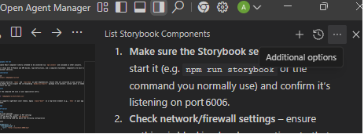

# Redpumpkin UI Kit

A reusable React component library intended to be installed via `npm install` and consumed in other projects.

The kit ships both ES Module and UMD builds, type definitions, and a compiled stylesheet. Components are built on top of Radix UI and related libraries.

## Installation

Since this library is not published to npm, you can install it directly from the Git repository.

### 1. Install the package

```bash
# Using npm
npm install git+https://github.com/Redpumpkin/redpumpkin-ui-kit.git

# Using yarn
yarn add git+https://github.com/Redpumpkin/redpumpkin-ui-kit.git

# Using pnpm
pnpm add git+https://github.com/Redpumpkin/redpumpkin-ui-kit.git
```

> **Note**: Replace the URL with your specific branch URL if needed (e.g., `git+https://github.com/Redpumpkin/redpumpkin-ui-kit.git#branch-name`).

### 2. Install Peer Dependencies

This library has minimal peer dependencies: `react` and `react-dom`.

Ensure they are installed in your project (versions ^18.0.0 or ^19.0.0).

> **Note**: All other internal dependencies (like Radix UI primitives) are automatically installed when you add the package.

## Styles

Import the compiled CSS once in your application entry:

```ts
import 'redpumpkin-ui-kit/style.css'
```

The kit supports light/dark color tokens. Apply `class="dark"` on a top-level element (e.g., `html` or your app wrapper) to enable dark mode.

## Usage

### MCP Server

#### Trae
1. Open Trae settings
2. Navigate settings' sidebar to MCP settings
3. Click add MCP and choose `add manually`
4. Click Raw config JSON and paste the following configuration

  ```json
  {
    "mcpServers": {
      "storybook-mcp": {
        "url": "http://localhost:6006/mcp"
      }
    }
  }
  ```

#### Google Antigravity


1. Open the `...` at the right of the agent conversation
2. Click `MCP Servers`
3. Click `Manage MCP Servers`
4. Click `View Raw Config`
5. Paste the following configuration
  ```json
  {
    "mcpServers": {
      "storybook-mcp": {
        "serverUrl": "http://localhost:6006/mcp/",
        "headers": {},
        "disabled": false
      }
    }
  }
  ```

### Utilizing Components

Import components directly from the package:

```tsx
import { Button, Accordion } from 'redpumpkin-ui-kit'

export default function Example() {
  return (
    <div>
      <Button variant="default">Click me</Button>
      <Accordion>{/* ... */}</Accordion>
    </div>
  )
}
```

All components are exported from the package root. Examples include `Accordion`, `AlertDialog`, `Avatar`, `Badge`, `Breadcrumb`, `Button`, `Calendar`, `Card`, `Carousel`, `Chart`, `Checkbox`, `Collapsible`, `Command`, `ContextMenu`, `Dialog`, `Drawer`, `DropdownMenu`, `Empty`, `Field`, `Form`, `HoverCard`, `Input`, `InputGroup`, `InputOTP`, `Item`, `Kbd`, `Label`, `Menubar`, `NavigationMenu`, `Pagination`, `Popover`, `Progress`, `RadioGroup`, `Resizable`, `ScrollArea`, `Select`, `Separator`, `Sheet`, `Sidebar`, `Skeleton`, `Slider`, `Sonner`, `Spinner`, `Switch`, `Table`, `Tabs`, `Textarea`, `Toggle`, `ToggleGroup`, `Tooltip`.

## Module Formats

- ESM: `redpumpkin-ui-kit.es.js` for modern bundlers (`import { Button } from 'redpumpkin-ui-kit'`).
- Types: `redpumpkin-ui-kit.d.ts` for TypeScript.

## Notes

- Tree-shaking works with named exports; import only what you use.
- When using components backed by Radix UI or other peer libraries, ensure the corresponding peer dependency is installed.

## Local Development

```bash
npm run dev
npm run build
npm run lint
```

This repository uses Vite in library mode and generates type declarations during `build`.
